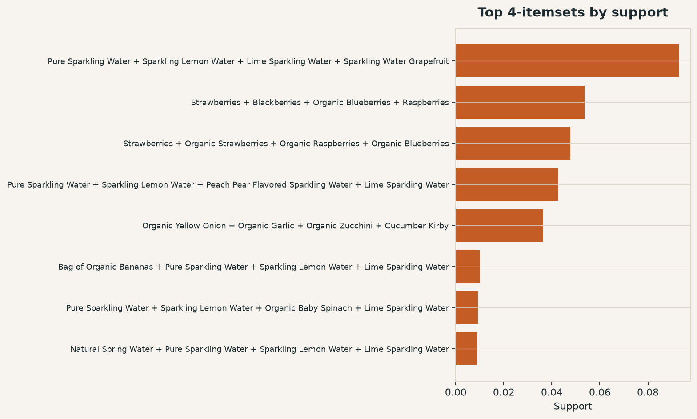
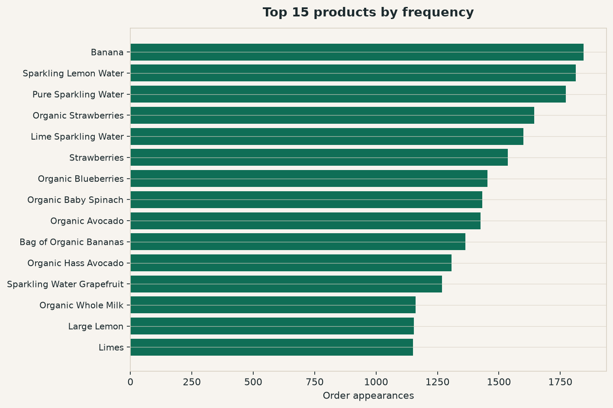
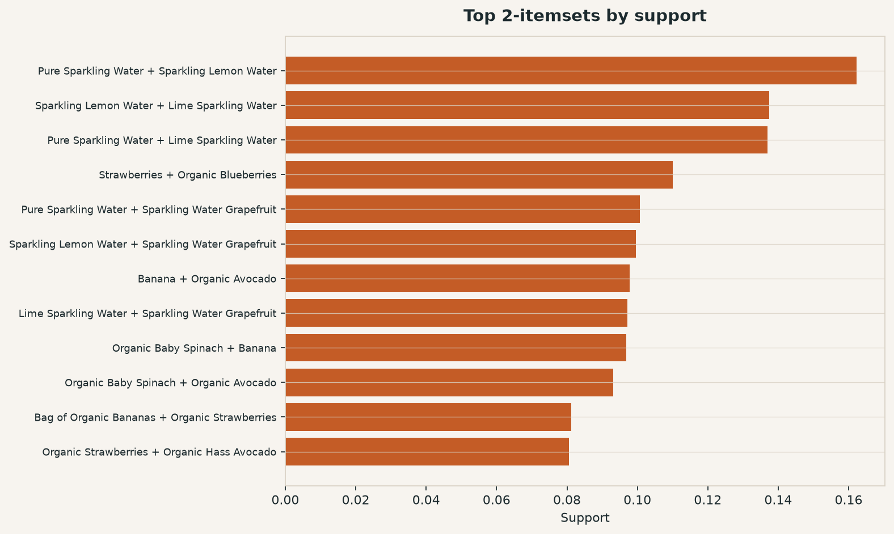
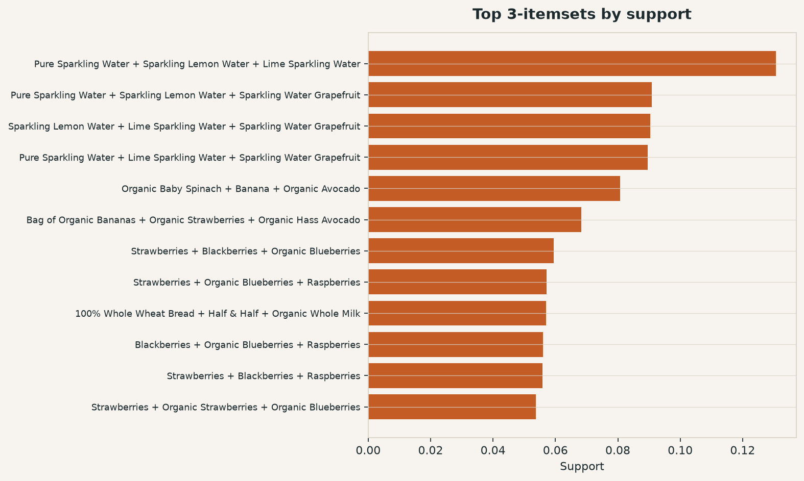
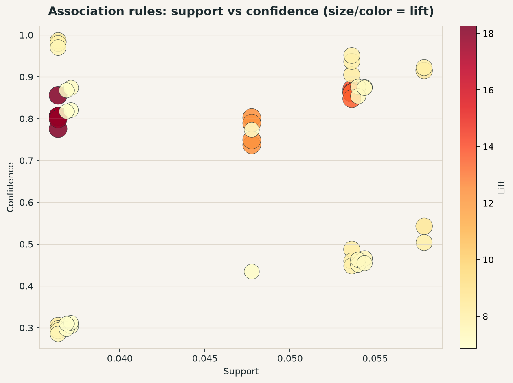
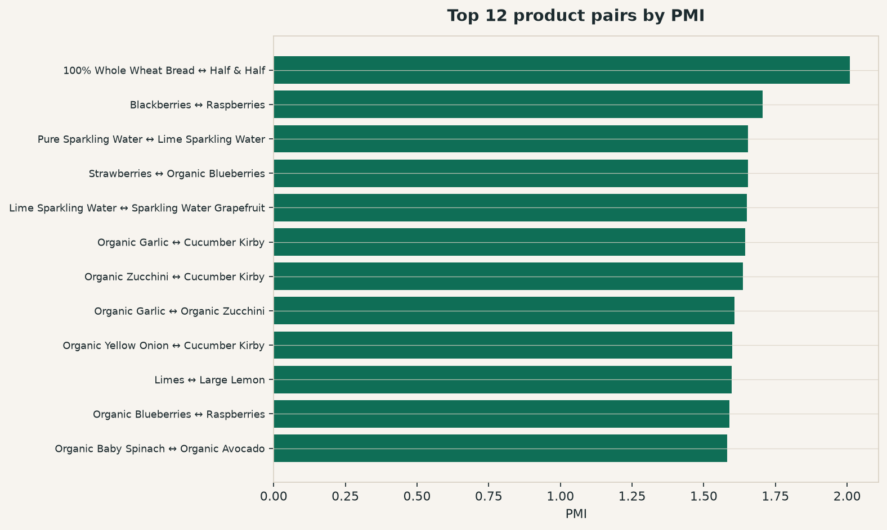
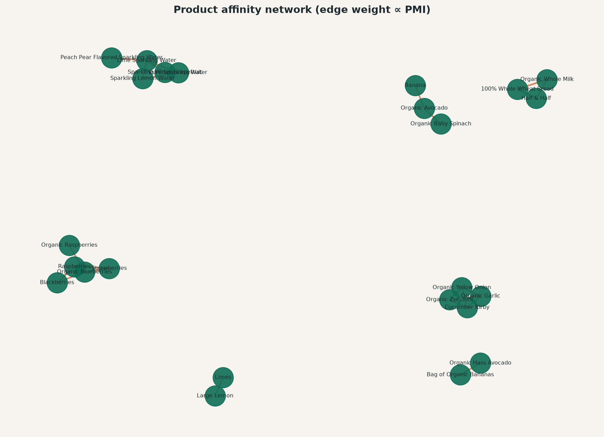
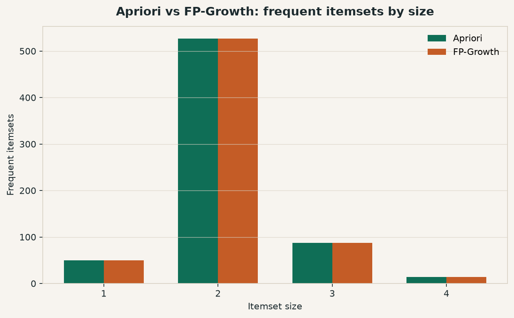
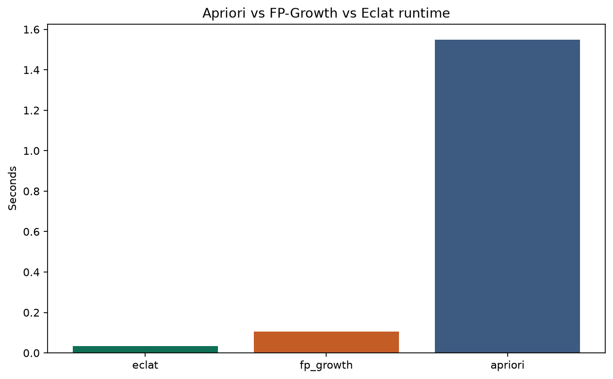

# Market Basket Analysis

**What should go next in the cart?**  
This repo turns that retail question into a clear data-science story: from a first Instacart association notebook to a full market-basket lab you can run, compare, and demo.

You start with the **original exploratory notebook** (kept as stage 1). Then you move to a reusable Python toolkit that mines frequent itemsets (**Apriori**, **FP-Growth**, **Eclat**), ranks **association rules**, maps **PMI affinities**, follows **next-order sequences**, and suggests products with **CF / SVD recommenders** — all backed by figures, holdout metrics, and a **Streamlit** lab.

Built for a personal portfolio: same business problem, two eras of approach, one reproducible pipeline on Instacart-like baskets.

<p align="center">
  
</p>

<p align="center">
  <em>Sparkling waters and berry mixes — the classic co-purchase themes, now with proper support, lift, and visuals.</em>
</p>

**Stack:** Python · pandas · mlxtend · scikit-learn · Plotly · Streamlit · NetworkX  

**Topics:** `market-basket-analysis` · `association-rules` · `apriori` · `fp-growth` · `eclat` · `instacart` · `recommender-systems` · `data-mining` · `retail-analytics` · `streamlit` · `python` · `data-science`

> **GitHub About** (Settings → General): paste the short blurb + topics from [`GITHUB_ABOUT.md`](GITHUB_ABOUT.md) — the API token on this agent cannot edit repo metadata.

---

## Timeline of approaches

Both notebooks stay in the repo on purpose — so you can see how the analysis evolved.

| Stage | Artifact | Approach |
|---|---|---|
| **1. Original** | [`Association Analysis.ipynb`](Association%20Analysis.ipynb) *(unchanged)* | Exploratory Instacart cut-down: keep products with count > 500, keep orders of **exact** size 4, brute-force `itertools.combinations`, report raw co-occurrence counts for top 4-item lists (sparkling waters, berries) |
| **2. Enhanced toolkit** | [`notebooks/enhanced_association_analysis.ipynb`](notebooks/enhanced_association_analysis.ipynb) + `src/mba/` | True Apriori / FP-Growth / Eclat, association rules (lift, Zhang, utility, scope), PMI networks, sequential transitions, CF/SVD recommenders, holdout eval, figures + Streamlit |

Read the original first if you want the homework-style narrative; use the enhanced path for the production-style pipeline.

---

## What's in this repo

| Path | Role |
|---|---|
| `Association Analysis.ipynb` | **Original** notebook — kept as-is for the historical timeline |
| `notebooks/enhanced_association_analysis.ipynb` | Enhanced walkthrough (miners, rules, PMI, Eclat, sequential, recommenders, Streamlit) |
| `src/mba/` | Reusable Python package (see [module map](#module-map-srcmba)) |
| `app/streamlit_app.py` | Interactive Streamlit lab |
| `scripts/generate_sample_data.py` | Instacart-like sample with planted associations |
| `scripts/run_analysis.py` | End-to-end CLI → CSV + PNG + Plotly HTML |
| `scripts/test_mba.py` | Unit tests |
| `data/sample/` | Generated sample CSVs (ready to run) |
| `data/raw/` | Drop real Instacart files here (gitignored) |
| `figures/` | Static PNGs + `figures/interactive/` Plotly HTML |
| `results/` | Itemsets, rules, PMI, recs, timing, holdout metrics |

### Project tree

```text
MarketBasketAnalysis/
├── Association Analysis.ipynb          # original (preserved timeline)
├── app/streamlit_app.py
├── data/
│   ├── raw/                            # optional real Instacart
│   └── sample/                         # committed demo CSVs
├── figures/                            # 01–09 PNGs + interactive/
├── notebooks/enhanced_association_analysis.ipynb
├── results/                            # pipeline outputs
├── scripts/
│   ├── generate_sample_data.py
│   ├── run_analysis.py
│   └── test_mba.py
└── src/mba/                            # toolkit package
```

---

## What the original approach did (and why we extended it)

The original notebook *mentioned* Apriori but actually:

1. Filtered to orders of **exactly** size 4 (should be **≥ 4**)
2. Enumerated all `itertools.combinations` (no support pruning)
3. Reported raw counts only — no confidence / lift / rules
4. Had almost no visualization

We **do not replace** that notebook — it remains the stage-1 baseline. The toolkit below is stage 2.

---

## Techniques included

### Frequent-itemset miners
| Method | Idea | Typical role |
|---|---|---|
| **Apriori** | Level-wise candidates + anti-monotonic prune | Teaching / reference |
| **FP-Growth** | Compressed FP-tree, no candidates | Fast production mining |
| **Eclat** | Vertical tid-list intersections | Sparse / depth-first baseline |

On the sample prior set (~7.3k baskets, `minsup=0.01`, `max_len=4`):

| Method | Itemsets | Runtime | Agrees with Apriori |
|---|---:|---:|:---:|
| Eclat | 590 | ~0.03 s | yes |
| FP-Growth | 590 | ~0.11 s | yes |
| Apriori | 590 | ~1.5 s | — |

### Association rules
Support, confidence, lift, leverage, conviction, plus:
- **Zhang** interestingness (signed dependence)
- **Utility** ≈ `lift × Σ margins` (synthetic `unit_margin` in sample data)
- **Scope** labels: `intra_aisle` / `intra_department` / `cross_department`

### Complementary views
- **PMI / Jaccard** affinity pairs + network graph
- **Sequential transitions** `A in order t ⇒ B in order t+1` (needs `orders.csv`)
- **Recommenders**: item-item cosine CF and TruncatedSVD
- **Holdout eval**: rule pair precision + recommender recall@k (prior → train)

### Filters
- Reordered vs first-time line items (`--reordered-only`)
- Department / aisle constrained mining (via product joins)
- Prefer `data/raw/` when real Instacart CSVs are present

---

## Module map (`src/mba/`)

| Module | Responsibility |
|---|---|
| `data.py` | Load CSVs, enrich aisle/dept, filters (freq / size / reordered / department), transactions |
| `apriori.py` | Classical Apriori frequent-itemset mining |
| `fp_growth.py` | FP-Growth via mlxtend (same output contract) |
| `eclat.py` | Eclat tid-list intersections |
| `rules.py` | Association rules + Zhang + utility + scope annotation |
| `affinity.py` | Pairwise PMI / Jaccard + co-occurrence matrix |
| `sequential.py` | User timelines → next-order transitions |
| `recommend.py` | Item-item CF, SVD, conditional co-occurrence baseline |
| `benchmark.py` | Runtime + agreement table across miners |
| `evaluate.py` | Holdout pair precision / coverage + recall@k |
| `visualize.py` | Static Matplotlib / Seaborn figures |
| `interactive.py` | Plotly charts (rules, network, benchmark, itemsets) |

---

## Sample data schema

Generated by `python scripts/generate_sample_data.py` into `data/sample/`:

| File | Key columns | Notes |
|---|---|---|
| `products.csv` | `product_id`, `product_name`, `aisle_id`, `department_id`, `unit_margin` | ~50 SKUs; margins for utility ranking |
| `aisles.csv` | `aisle_id`, `aisle` | e.g. fresh fruits, sparkling water |
| `departments.csv` | `department_id`, `department` | produce, beverages, dairy, … |
| `orders.csv` | `order_id`, `user_id`, `eval_set`, `order_number`, `order_dow`, `order_hour_of_day`, `days_since_prior_order` | `eval_set` ∈ {`prior`, `train`} |
| `order_products__prior.csv` | `order_id`, `product_id`, `add_to_cart_order`, `reordered` | History used for mining / holdout train |
| `order_products__train.csv` | same | Last order per user (holdout) |

**Planted themes** (so demos stay stable without Kaggle credentials):
- Sparkling-water quartet, berry mixes, produce staples
- Sequential habits (e.g. banana → milk, pure sparkling → lemon sparkling)

Defaults: `--n-users 1200`, `--seed 42` → ~8.5k orders.

For real Instacart, drop the same filenames into `data/raw/`; the pipeline prefers that folder automatically.

---

## Quick start

```bash
pip install -r requirements.txt

# Sample data (already committed; regenerate if needed)
python scripts/generate_sample_data.py

# Full pipeline
python scripts/run_analysis.py \
  --min-support 0.01 \
  --min-confidence 0.2 \
  --min-lift 1.05

# Tests
python scripts/test_mba.py

# Streamlit demo
streamlit run app/streamlit_app.py

# Notebook
jupyter notebook notebooks/enhanced_association_analysis.ipynb
```

---

## CLI reference

### `scripts/generate_sample_data.py`

| Flag | Default | Description |
|---|---|---|
| `--n-users` | `1200` | Number of synthetic shoppers |
| `--seed` | `42` | RNG seed |
| `--out-dir` | `data/sample` | Output directory |

### `scripts/run_analysis.py`

| Flag | Default | Description |
|---|---|---|
| `--data-dir` | auto (`raw` → `sample`) | Dataset directory override |
| `--min-product-count` | `30` | Drop rare SKUs before mining |
| `--min-support` | `0.01` | Frequent-itemset threshold |
| `--min-confidence` | `0.25` | Rule confidence floor |
| `--min-lift` | `1.1` | Rule lift floor |
| `--max-len` | `4` | Max itemset size |
| `--reordered-only` | `all` | `all` \| `reordered` \| `first` |
| `--figures-dir` | `figures/` | PNG + interactive HTML output |
| `--results-dir` | `results/` | CSV / JSON tables |

Example — only reordered line items, stricter rules:

```bash
python scripts/run_analysis.py \
  --reordered-only reordered \
  --min-support 0.015 \
  --min-confidence 0.3 \
  --min-lift 1.2
```

---

## Pipeline outputs (`results/`)

| File | Contents |
|---|---|
| `frequent_itemsets_apriori.csv` | Itemsets from Apriori |
| `frequent_itemsets_fpgrowth.csv` | Itemsets from FP-Growth |
| `frequent_itemsets_eclat.csv` | Itemsets from Eclat |
| `association_rules.csv` | Rules + Zhang / utility / scope |
| `pairwise_pmi.csv` | Top PMI / Jaccard pairs |
| `sequential_transitions.csv` | Next-order A ⇒ B transitions |
| `recs_item_item.csv` | Cosine CF demo recommendations |
| `recs_svd.csv` | SVD demo recommendations |
| `timing.csv` | Miner runtime + agreement |
| `holdout_metrics.json` | Rule pair precision / coverage + recall@k |

---

## Sample results

Top 4-itemsets recover the original notebook themes:

1. **Sparkling water flight** — Pure / Lemon / Lime / Grapefruit (`support ≈ 0.09`)
2. **Berry mix** — Strawberries / Blackberries / Organic Blueberries / Raspberries (`support ≈ 0.055`)

Holdout (rules trained on prior, scored on train): top-20 rule pair precision = **1.0**, basket coverage ≈ **13%**; item-item recall@5 ≈ **0.41** on the sample.

---

## Visualizations

### Frequency & itemsets





### Rules & affinity




### Miner comparison



### Interactive Plotly HTML

Open in a browser (also embedded in the Streamlit app):

| File | Chart |
|---|---|
| `figures/interactive/top_quadruples.html` | Top 4-itemsets |
| `figures/interactive/rules_scatter.html` | Support vs confidence (lift) |
| `figures/interactive/affinity_network.html` | PMI network |
| `figures/interactive/benchmark.html` | Runtime bars |

---

## Streamlit lab

```bash
streamlit run app/streamlit_app.py
```

Tabs:
1. **Itemsets & rules** — Apriori itemsets + interactive rule scatter  
2. **Affinity network** — PMI graph  
3. **Benchmark** — Apriori / FP-Growth / Eclat timing  
4. **Sequential** — next-order transitions  
5. **Recommend** — item-item CF + SVD for a seed product  

Sidebar controls: min support / confidence / lift, max itemset size, reordered filter, rule scope.

---

## Package API (short)

```python
import sys
sys.path.insert(0, "src")

from mba.apriori import apriori, frequent_itemsets_to_frame
from mba.eclat import eclat
from mba.fp_growth import fp_growth
from mba.rules import association_rules, annotate_rule_departments
from mba.affinity import pairwise_pmi
from mba.sequential import sequential_transitions, user_sequences_from_orders
from mba.recommend import item_item_recommendations, svd_recommendations
from mba.benchmark import benchmark_miners
from mba.evaluate import pair_hit_rate

freq = apriori(transactions, min_support=0.01, max_len=4)
rules = association_rules(freq, min_confidence=0.3, min_lift=1.2, margin_map=margins)
rules = annotate_rule_departments(rules, products)
timing = benchmark_miners(transactions, min_support=0.01, max_len=4)
```

CLI scripts and Streamlit add `src/` to `PYTHONPATH` for you. From a notebook started in `notebooks/`, the first cell resolves the repo root the same way.

---

## Architecture

```text
orders + order_products + products (+ aisles/departments)
        │
        ├─► filter (freq / size / reordered / department)
        │
        ├─► Apriori / FP-Growth / Eclat ─► rules (+ Zhang, utility, scope)
        ├─► PMI affinity network
        ├─► sequential transitions (user timelines)
        ├─► item-item CF + SVD recommenders
        └─► holdout metrics (prior → train)
                 │
                 ├─► results/*.csv|json
                 ├─► figures/*.png
                 └─► figures/interactive/*.html  +  Streamlit app
```

---

## License / data

Code is for personal / educational use. If you use the official Instacart 2017 dataset, follow Instacart’s non-commercial terms and cite:

> “The Instacart Online Grocery Shopping Dataset 2017”
